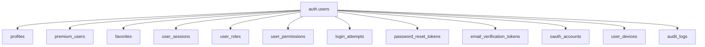
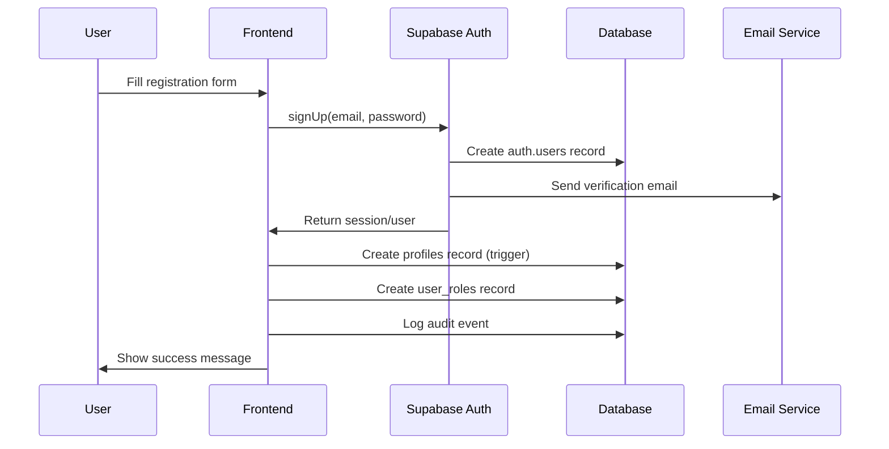
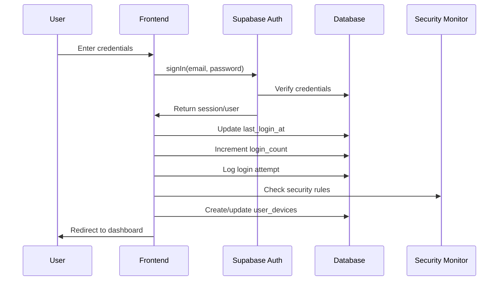
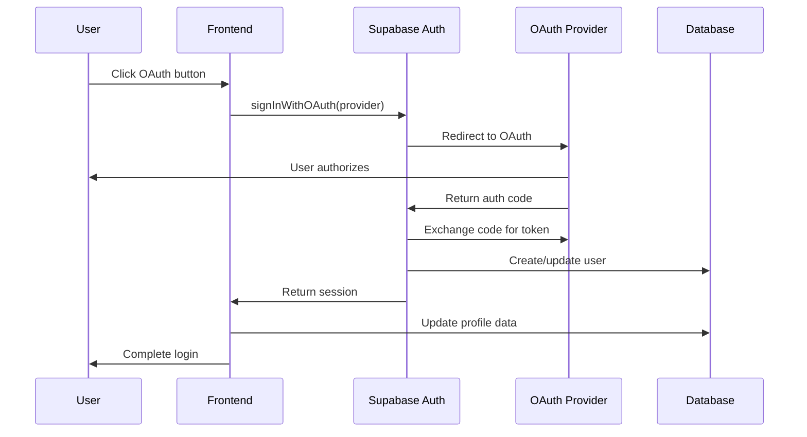

# 🔐 Authentication Database Flow & Best Practices

## 📊 Database Architecture Overview

### Core Tables Structure



## 🗄️ Database Schema Design

### 1. Core Authentication Tables

#### `auth.users` (Supabase Built-in)
```sql
-- Managed by Supabase Auth
-- Contains: id, email, encrypted_password, email_confirmed_at, 
--          created_at, updated_at, last_sign_in_at, raw_user_meta_data
```

#### `profiles` (Extended User Data)
```sql
CREATE TABLE profiles (
    id UUID REFERENCES auth.users(id) ON DELETE CASCADE PRIMARY KEY,
    email TEXT UNIQUE NOT NULL,
    display_name TEXT,
    avatar_url TEXT,
    bio TEXT,
    location TEXT,
    website TEXT,
    phone TEXT,
    date_of_birth DATE,
    gender TEXT CHECK (gender IN ('male', 'female', 'other', 'prefer_not_to_say')),
    email_verified BOOLEAN DEFAULT FALSE,
    phone_verified BOOLEAN DEFAULT FALSE,
    two_factor_enabled BOOLEAN DEFAULT FALSE,
    two_factor_secret TEXT,
    last_login_at TIMESTAMP WITH TIME ZONE,
    login_count INTEGER DEFAULT 0,
    status TEXT DEFAULT 'active' CHECK (status IN ('active', 'suspended', 'banned', 'pending')),
    preferences JSONB DEFAULT '{}',
    settings JSONB DEFAULT '{}',
    created_at TIMESTAMP WITH TIME ZONE DEFAULT NOW(),
    updated_at TIMESTAMP WITH TIME ZONE DEFAULT NOW()
);
```

#### `user_roles` (Role-Based Access Control)
```sql
CREATE TABLE user_roles (
    id UUID DEFAULT gen_random_uuid() PRIMARY KEY,
    user_id UUID REFERENCES auth.users(id) ON DELETE CASCADE NOT NULL,
    role_name TEXT NOT NULL CHECK (role_name IN ('user', 'premium', 'moderator', 'admin', 'super_admin')),
    granted_by UUID REFERENCES auth.users(id),
    granted_at TIMESTAMP WITH TIME ZONE DEFAULT NOW(),
    expires_at TIMESTAMP WITH TIME ZONE,
    is_active BOOLEAN DEFAULT TRUE,
    UNIQUE(user_id, role_name)
);
```

#### `user_permissions` (Granular Permissions)
```sql
CREATE TABLE user_permissions (
    id UUID DEFAULT gen_random_uuid() PRIMARY KEY,
    user_id UUID REFERENCES auth.users(id) ON DELETE CASCADE NOT NULL,
    permission_name TEXT NOT NULL,
    resource_type TEXT NOT NULL,
    resource_id TEXT,
    granted_by UUID REFERENCES auth.users(id),
    granted_at TIMESTAMP WITH TIME ZONE DEFAULT NOW(),
    expires_at TIMESTAMP WITH TIME ZONE,
    is_active BOOLEAN DEFAULT TRUE
);
```

### 2. Security & Monitoring Tables

#### `login_attempts` (Security Monitoring)
```sql
CREATE TABLE login_attempts (
    id UUID DEFAULT gen_random_uuid() PRIMARY KEY,
    user_id UUID REFERENCES auth.users(id) ON DELETE CASCADE,
    email TEXT NOT NULL,
    ip_address INET,
    user_agent TEXT,
    success BOOLEAN NOT NULL,
    failure_reason TEXT,
    attempted_at TIMESTAMP WITH TIME ZONE DEFAULT NOW(),
    location_data JSONB
);
```

#### `user_devices` (Device Management)
```sql
CREATE TABLE user_devices (
    id UUID DEFAULT gen_random_uuid() PRIMARY KEY,
    user_id UUID REFERENCES auth.users(id) ON DELETE CASCADE NOT NULL,
    device_id TEXT UNIQUE NOT NULL,
    device_name TEXT,
    device_type TEXT,
    browser_info JSONB,
    os_info JSONB,
    ip_address INET,
    is_trusted BOOLEAN DEFAULT FALSE,
    last_used_at TIMESTAMP WITH TIME ZONE DEFAULT NOW(),
    created_at TIMESTAMP WITH TIME ZONE DEFAULT NOW()
);
```

#### `audit_logs` (Security Audit Trail)
```sql
CREATE TABLE audit_logs (
    id UUID DEFAULT gen_random_uuid() PRIMARY KEY,
    user_id UUID REFERENCES auth.users(id) ON DELETE CASCADE,
    action TEXT NOT NULL,
    resource_type TEXT,
    resource_id TEXT,
    old_values JSONB,
    new_values JSONB,
    ip_address INET,
    user_agent TEXT,
    created_at TIMESTAMP WITH TIME ZONE DEFAULT NOW()
);
```

### 3. Premium & Subscription Tables

#### `premium_users` (Enhanced)
```sql
CREATE TABLE premium_users (
    id UUID DEFAULT gen_random_uuid() PRIMARY KEY,
    user_id UUID REFERENCES auth.users(id) ON DELETE CASCADE NOT NULL,
    email TEXT UNIQUE NOT NULL,
    subscription_status TEXT DEFAULT 'active' CHECK (subscription_status IN ('active', 'canceled', 'past_due', 'unpaid')),
    subscription_tier TEXT DEFAULT 'basic' CHECK (subscription_tier IN ('basic', 'premium', 'enterprise')),
    payment_provider TEXT DEFAULT 'stripe',
    payment_provider_id TEXT,
    current_period_start TIMESTAMP WITH TIME ZONE,
    current_period_end TIMESTAMP WITH TIME ZONE,
    cancel_at_period_end BOOLEAN DEFAULT FALSE,
    trial_start TIMESTAMP WITH TIME ZONE,
    trial_end TIMESTAMP WITH TIME ZONE,
    created_at TIMESTAMP WITH TIME ZONE DEFAULT NOW(),
    updated_at TIMESTAMP WITH TIME ZONE DEFAULT NOW()
);
```

## 🔄 Authentication Flow

### 1. User Registration Flow



### 2. User Login Flow



### 3. OAuth Authentication Flow



## 🛡️ Security Best Practices

### 1. Password Security
```sql
-- Enforce strong password policy
CREATE OR REPLACE FUNCTION validate_password_strength(password TEXT)
RETURNS BOOLEAN AS $$
BEGIN
    RETURN 
        length(password) >= 8 AND
        password ~ '[A-Z]' AND
        password ~ '[a-z]' AND
        password ~ '[0-9]' AND
        password ~ '[^A-Za-z0-9]';
END;
$$ LANGUAGE plpgsql;
```

### 2. Rate Limiting
```sql
-- Rate limiting for login attempts
CREATE OR REPLACE FUNCTION check_login_rate_limit(email TEXT, ip_address INET)
RETURNS BOOLEAN AS $$
DECLARE
    attempt_count INTEGER;
BEGIN
    SELECT COUNT(*) INTO attempt_count
    FROM login_attempts
    WHERE (login_attempts.email = check_login_rate_limit.email OR login_attempts.ip_address = check_login_rate_limit.ip_address)
    AND attempted_at > NOW() - INTERVAL '15 minutes'
    AND success = FALSE;
    
    RETURN attempt_count < 5;
END;
$$ LANGUAGE plpgsql;
```

### 3. Session Management
```sql
-- Session timeout and cleanup
CREATE OR REPLACE FUNCTION cleanup_expired_sessions()
RETURNS INTEGER AS $$
DECLARE
    deleted_count INTEGER;
BEGIN
    DELETE FROM user_sessions
    WHERE session_end < NOW() - INTERVAL '30 days'
    OR (session_end IS NULL AND session_start < NOW() - INTERVAL '24 hours');
    
    GET DIAGNOSTICS deleted_count = ROW_COUNT;
    RETURN deleted_count;
END;
$$ LANGUAGE plpgsql;
```

### 4. Row Level Security (RLS) Policies

#### Profiles Table
```sql
-- Users can only view their own profile or public profiles
CREATE POLICY "profiles_select_policy" ON profiles
    FOR SELECT USING (
        auth.uid() = id OR 
        (preferences->>'privacy'->>'profile_visible')::boolean = true
    );

-- Users can only update their own profile
CREATE POLICY "profiles_update_policy" ON profiles
    FOR UPDATE USING (auth.uid() = id);

-- Only authenticated users can insert profiles
CREATE POLICY "profiles_insert_policy" ON profiles
    FOR INSERT WITH CHECK (auth.uid() = id);
```

#### Premium Users Table
```sql
-- Users can only view their own premium status
CREATE POLICY "premium_users_select_policy" ON premium_users
    FOR SELECT USING (auth.uid() = user_id);

-- Only service role can manage premium users
CREATE POLICY "premium_users_manage_policy" ON premium_users
    FOR ALL USING (auth.role() = 'service_role');
```

## 📊 Database Indexes for Performance

```sql
-- Core indexes for authentication
CREATE INDEX idx_profiles_email ON profiles(email);
CREATE INDEX idx_profiles_status ON profiles(status);
CREATE INDEX idx_profiles_email_verified ON profiles(email_verified);

-- Security monitoring indexes
CREATE INDEX idx_login_attempts_email_time ON login_attempts(email, attempted_at);
CREATE INDEX idx_login_attempts_ip_time ON login_attempts(ip_address, attempted_at);
CREATE INDEX idx_login_attempts_success ON login_attempts(success, attempted_at);

-- User roles and permissions
CREATE INDEX idx_user_roles_user_id ON user_roles(user_id);
CREATE INDEX idx_user_roles_active ON user_roles(is_active);
CREATE INDEX idx_user_permissions_user_id ON user_permissions(user_id);

-- Premium users
CREATE INDEX idx_premium_users_user_id ON premium_users(user_id);
CREATE INDEX idx_premium_users_status ON premium_users(subscription_status);
CREATE INDEX idx_premium_users_period_end ON premium_users(current_period_end);

-- Audit logs
CREATE INDEX idx_audit_logs_user_id ON audit_logs(user_id);
CREATE INDEX idx_audit_logs_action ON audit_logs(action);
CREATE INDEX idx_audit_logs_created_at ON audit_logs(created_at);
```

## 🔧 Database Functions

### 1. User Management Functions

```sql
-- Get user with all related data
CREATE OR REPLACE FUNCTION get_user_complete_profile(user_uuid UUID)
RETURNS TABLE (
    profile_data JSONB,
    roles TEXT[],
    permissions JSONB,
    premium_status JSONB,
    device_count INTEGER,
    last_login TIMESTAMP WITH TIME ZONE
) AS $$
BEGIN
    RETURN QUERY
    SELECT 
        to_jsonb(p.*) as profile_data,
        array_agg(ur.role_name) FILTER (WHERE ur.is_active = true) as roles,
        jsonb_agg(up.*) FILTER (WHERE up.is_active = true) as permissions,
        to_jsonb(pu.*) as premium_status,
        COUNT(ud.id)::INTEGER as device_count,
        p.last_login_at as last_login
    FROM profiles p
    LEFT JOIN user_roles ur ON p.id = ur.user_id
    LEFT JOIN user_permissions up ON p.id = up.user_id
    LEFT JOIN premium_users pu ON p.id = pu.user_id
    LEFT JOIN user_devices ud ON p.id = ud.user_id
    WHERE p.id = user_uuid
    GROUP BY p.id, pu.id;
END;
$$ LANGUAGE plpgsql SECURITY DEFINER;
```

### 2. Security Functions

```sql
-- Check if user has permission
CREATE OR REPLACE FUNCTION user_has_permission(
    user_uuid UUID,
    permission_name TEXT,
    resource_type TEXT DEFAULT NULL,
    resource_id TEXT DEFAULT NULL
)
RETURNS BOOLEAN AS $$
BEGIN
    RETURN EXISTS(
        SELECT 1 FROM user_permissions up
        WHERE up.user_id = user_has_permission.user_uuid
        AND up.permission_name = user_has_permission.permission_name
        AND (user_has_permission.resource_type IS NULL OR up.resource_type = user_has_permission.resource_type)
        AND (user_has_permission.resource_id IS NULL OR up.resource_id = user_has_permission.resource_id)
        AND up.is_active = true
        AND (up.expires_at IS NULL OR up.expires_at > NOW())
    );
END;
$$ LANGUAGE plpgsql SECURITY DEFINER;
```

## 📈 Monitoring & Analytics

### 1. User Activity Tracking
```sql
-- Track user activity metrics
CREATE OR REPLACE FUNCTION track_user_activity(
    user_uuid UUID,
    activity_type TEXT,
    activity_data JSONB DEFAULT NULL
)
RETURNS UUID AS $$
DECLARE
    activity_id UUID;
BEGIN
    INSERT INTO audit_logs (
        user_id,
        action,
        resource_type,
        new_values
    ) VALUES (
        user_uuid,
        activity_type,
        'user_activity',
        activity_data
    ) RETURNING id INTO activity_id;
    
    RETURN activity_id;
END;
$$ LANGUAGE plpgsql SECURITY DEFINER;
```

### 2. Security Monitoring
```sql
-- Monitor suspicious activity
CREATE OR REPLACE FUNCTION detect_suspicious_activity(user_uuid UUID)
RETURNS TABLE (
    risk_level TEXT,
    risk_factors JSONB,
    recommendations JSONB
) AS $$
DECLARE
    failed_attempts INTEGER;
    device_count INTEGER;
    recent_logins INTEGER;
BEGIN
    -- Count failed login attempts
    SELECT COUNT(*) INTO failed_attempts
    FROM login_attempts
    WHERE user_id = detect_suspicious_activity.user_uuid
    AND attempted_at > NOW() - INTERVAL '1 hour'
    AND success = FALSE;
    
    -- Count devices
    SELECT COUNT(*) INTO device_count
    FROM user_devices
    WHERE user_id = detect_suspicious_activity.user_uuid;
    
    -- Count recent logins
    SELECT COUNT(*) INTO recent_logins
    FROM login_attempts
    WHERE user_id = detect_suspicious_activity.user_uuid
    AND attempted_at > NOW() - INTERVAL '24 hours'
    AND success = TRUE;
    
    RETURN QUERY
    SELECT 
        CASE 
            WHEN failed_attempts > 5 THEN 'high'
            WHEN failed_attempts > 3 THEN 'medium'
            ELSE 'low'
        END as risk_level,
        jsonb_build_object(
            'failed_attempts', failed_attempts,
            'device_count', device_count,
            'recent_logins', recent_logins
        ) as risk_factors,
        jsonb_build_object(
            'enable_2fa', failed_attempts > 3,
            'review_devices', device_count > 5,
            'contact_support', failed_attempts > 10
        ) as recommendations;
END;
$$ LANGUAGE plpgsql SECURITY DEFINER;
```

## 🚀 Implementation Checklist

### Phase 1: Core Authentication
- [ ] Set up Supabase Auth with email/password
- [ ] Configure OAuth providers (Google, Facebook)
- [ ] Implement email verification
- [ ] Set up password reset flow
- [ ] Create profiles table with RLS policies

### Phase 2: Security Enhancement
- [ ] Implement login attempt tracking
- [ ] Add rate limiting
- [ ] Set up device management
- [ ] Create audit logging system
- [ ] Implement session management

### Phase 3: Role-Based Access Control
- [ ] Create user_roles table
- [ ] Implement permission system
- [ ] Set up admin/moderator roles
- [ ] Create role-based UI components

### Phase 4: Premium Features
- [ ] Set up premium_users table
- [ ] Integrate with Stripe
- [ ] Implement subscription management
- [ ] Create premium feature gates

### Phase 5: Monitoring & Analytics
- [ ] Set up security monitoring
- [ ] Implement user activity tracking
- [ ] Create admin dashboard
- [ ] Set up automated alerts

## 🔒 Security Checklist

- [ ] Enable HTTPS in production
- [ ] Implement proper CORS policies
- [ ] Set up CSP headers
- [ ] Use secure session cookies
- [ ] Implement account lockout after failed attempts
- [ ] Set up two-factor authentication
- [ ] Regular security audits
- [ ] Monitor for suspicious activity
- [ ] Keep dependencies updated
- [ ] Implement proper error handling

## 📚 Additional Resources

- [Supabase Auth Documentation](https://supabase.com/docs/guides/auth)
- [OWASP Authentication Cheat Sheet](https://cheatsheetseries.owasp.org/cheatsheets/Authentication_Cheat_Sheet.html)
- [NIST Digital Identity Guidelines](https://pages.nist.gov/800-63-3/)
- [Web Security Best Practices](https://developer.mozilla.org/en-US/docs/Web/Security)
